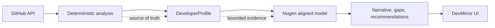
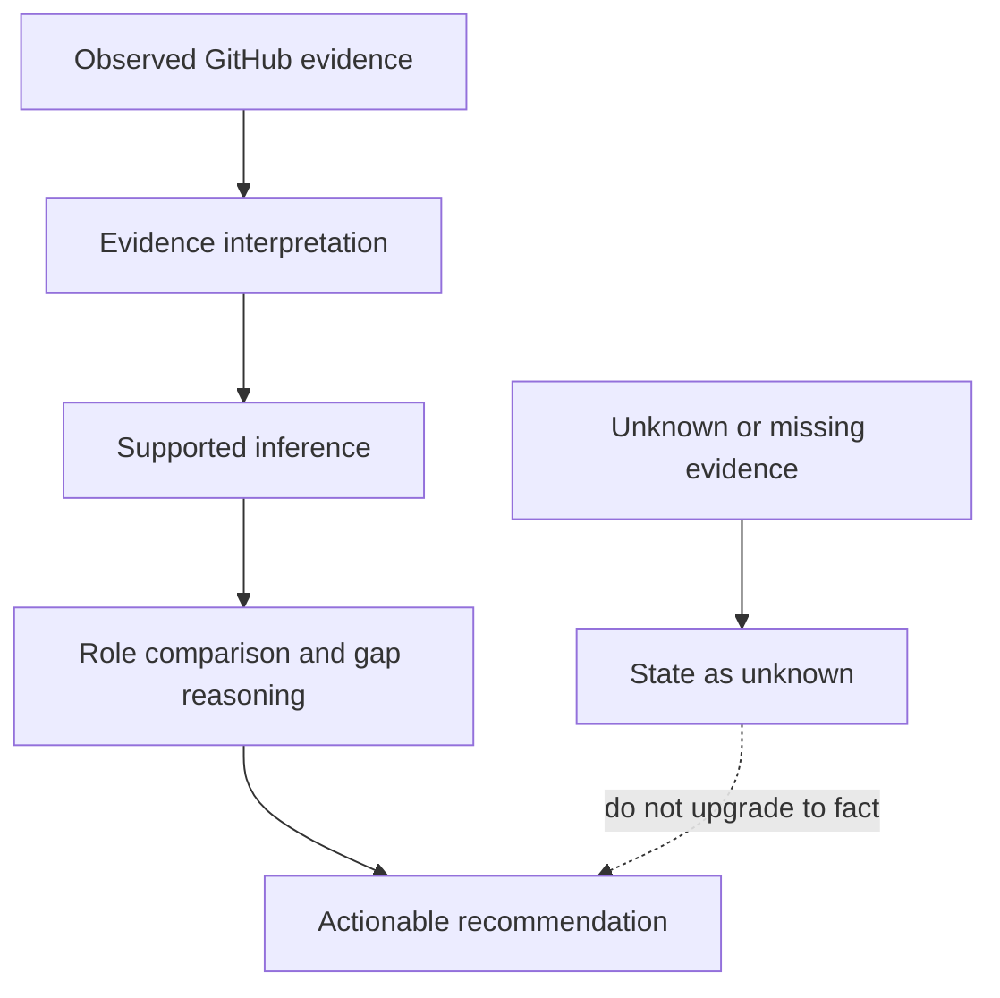
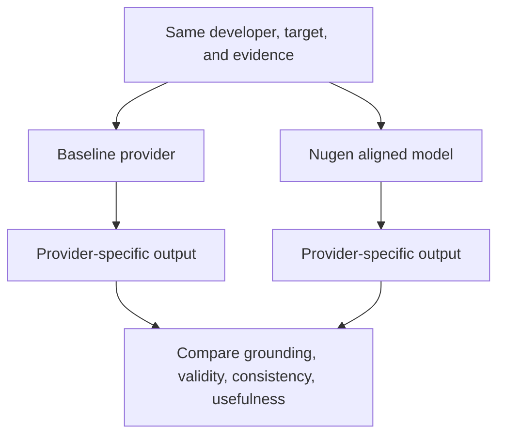

# DevMirror × Nugen --- Model Understanding

## 1. Purpose

This document explains the reasoning behind the Nugen integration in
DevMirror: what problem the aligned model is being used to solve, why
the **Developer Skill & Engineering Intelligence** domain was selected,
what the model receives as evidence, what it is expected to infer, and
how those inferences become useful product outputs.

The goal is not simply to demonstrate an API integration. The goal is to
show an understanding of the relationship between:

**domain alignment → evidence → inference → gap reasoning →
recommendation**

This document complements the main repository README and the
baseline-vs-Nugen test documentation.

------------------------------------------------------------------------

## 1.1 The One-Minute Explanation

I chose **Developer Skill & Engineering Intelligence** because DevMirror
is not trying to summarize arbitrary text. It is trying to reason about
software-engineering evidence: technologies, engineering practices,
AI/ML work, system design, reliability, and role-specific skill gaps.

The deterministic GitHub analyzer establishes what is observable. The
Nugen-aligned model interprets that evidence in the engineering domain
and turns it into narrative, gap reasoning, and recommendations. The
same evidence is sent to the baseline and Nugen providers so that any
provider-dependent difference can be isolated from changes in the
underlying developer data.

The experiment does not assume that alignment makes the model better. It
tests whether alignment changes the quality, grounding, consistency, and
usefulness of reasoning for this particular domain.

------------------------------------------------------------------------

## 2. The Problem: Developer Skill & Engineering Intelligence

DevMirror starts from observable public GitHub activity and builds a
structured `DeveloperProfile`.

The product then uses AI to help answer questions such as:

-   What technical work is visible in a developer's public repositories?
-   Which skills have supporting evidence?
-   Which skills are uncertain or not established by the available
    evidence?
-   How does one developer compare with another for a specific career
    goal?
-   What concrete actions could help close evidence-backed gaps?

The important challenge is that **observed GitHub signals are not the
same thing as demonstrated engineering proficiency**.

For example, the presence of a repository mentioning Python does not
automatically prove that the developer has strong Python proficiency.
Similarly, a repository topic mentioning RAG does not prove that the
developer implemented a production-quality RAG system.

Therefore, the system needs to distinguish:

> **what is observed**

from

> **what can reasonably be inferred**

and from

> **what remains unknown.**

This makes Developer Skill & Engineering Intelligence a useful domain
for testing domain-aligned reasoning.

------------------------------------------------------------------------

## 3. Why Domain Alignment?

A generic language model has broad knowledge across many subjects.
DevMirror, however, asks a narrower class of questions involving:

-   software engineering;
-   backend and frontend development;
-   AI/LLM engineering;
-   machine-learning engineering;
-   APIs and system design;
-   testing and CI/CD;
-   MLOps and production engineering;
-   developer proficiency;
-   skill-gap analysis; and
-   evidence-grounded recommendations.

The domain-aligned model is therefore used as a specialized reasoning
layer for this engineering context.

The intended benefit is not assumed to be "the model is automatically
more accurate."

Instead, the experiment asks:

> **Does a model aligned to the Developer Skill & Engineering
> Intelligence domain produce useful, appropriately grounded reasoning
> when given the same structured developer evidence?**

That distinction matters because model quality should be demonstrated
through evaluation rather than assumed from the existence of alignment.

------------------------------------------------------------------------

## 4. What Was Aligned

The Nugen alignment corpus was created for the domain:

**Developer Skill & Engineering Intelligence**

The documented coverage includes:

### Software Engineering

-   backend development;
-   frontend development;
-   full-stack development;
-   software engineering practices;
-   Git and GitHub;
-   testing;
-   code review;
-   documentation;
-   deployment.

### AI Engineering

-   LLM applications;
-   RAG;
-   agents;
-   embeddings;
-   semantic search;
-   evaluation;
-   deployment.

### ML Engineering

-   machine-learning fundamentals;
-   model development;
-   MLOps;
-   production ML;
-   reliability.

### Systems and APIs

-   REST APIs;
-   API design;
-   system design;
-   backend architecture;
-   databases;
-   production infrastructure.

### Developer Intelligence

-   developer proficiency;
-   skill-gap analysis;
-   role alignment;
-   evidence grounding;
-   reliability constraints.

The corpus is an assessment artifact used to create the aligned model.
It is not required as a runtime dependency by DevMirror.

------------------------------------------------------------------------

## 5. The Model's Role in DevMirror

The architecture deliberately separates **evidence generation** from
**AI reasoning**.



The deterministic analysis is the source of truth for the observable
GitHub evidence.

Nugen operates on the structured representation produced by that layer.

This means Nugen is not responsible for deciding whether a GitHub
repository exists, calculating repository statistics, or inventing
missing evidence.

Instead, its role is to reason over the evidence that the application
has already established.

------------------------------------------------------------------------

## 6. Evidence → Inference → Recommendation

The central mental model for the Developer Intelligence feature is:



### Example

Suppose the deterministic analyzer observes:

-   TypeScript repositories;
-   React repositories;
-   Next.js repositories;
-   visible web-development activity.

A reasonable inference is:

> The public GitHub evidence supports meaningful exposure to TypeScript
> and modern frontend/web development.

If the target role is **AI Engineer**, the next question becomes:

> What relevant AI-engineering capabilities are not established by the
> available evidence?

If the available evidence does not establish strong Python, RAG, LLM
application, backend API, or MLOps experience, the system can identify
those areas as gaps or areas requiring additional evidence.

The recommendation layer can then suggest actions such as:

-   build an AI/LLM application;
-   demonstrate RAG with evaluation;
-   strengthen backend/API engineering;
-   add testing and deployment;
-   demonstrate production-oriented engineering practices.

The important distinction is:

``` text
Evidence:
"TypeScript + React repositories exist"

        ≠

Claim:
"Developer is an expert frontend engineer"

        ≠

Claim:
"Developer has strong AI engineering skills"
```

The model should reason within what the evidence supports.

------------------------------------------------------------------------

## 7. Evidence Boundary

The deterministic GitHub analyzer currently has access to signals such
as:

-   repository metadata;
-   languages and language statistics;
-   repository topics;
-   repository descriptions;
-   root-file signals;
-   project signals; and
-   activity signals.

It does **not** inspect arbitrary source-code implementation details,
dependency manifests, README contents, or commit history in the current
evidence pipeline.

Therefore:

> A repository's existence, language metadata, or topic does not by
> itself prove implementation-level proficiency.

The Nugen reasoning layer is intentionally bounded by this evidence
representation.

Unsupported information should be treated as unknown rather than
silently invented.

This boundary is important because a Developer Intelligence system can
otherwise produce highly plausible but weakly grounded assessments.

------------------------------------------------------------------------

## 8. What the Nugen Model Is Expected to Infer

The aligned model is expected to perform higher-level reasoning over the
supplied evidence.

Examples include:

### Profile interpretation

What does the available evidence suggest about the developer's current
technical direction?

### Skill interpretation

Which engineering capabilities are supported by the evidence, and how
strong is the available evidence?

### Role comparison

Given two developer profiles and a target such as **AI Engineer**, what
differences matter?

### Gap reasoning

Which capabilities relevant to the target role are not established by
the available evidence?

### Recommendation reasoning

What projects, engineering practices, or learning actions would most
directly address those gaps?

The model should not turn missing evidence into a factual claim.

For example:

> "No evidence of RAG was found in the supplied profile"

is different from:

> "The developer has never built a RAG system."

The first is evidence-grounded. The second makes a claim about work that
the system cannot observe.

------------------------------------------------------------------------

## 9. Profile Enrichment

For the profile flow, the application follows approximately:

``` text
analyzeAndCache
    ↓
enrichProfileWithAI
    ↓
callStructuredWithMetadata({ provider: "nugen" })
    ↓
Nugen completion adapter
    ↓
structured AI output
    ↓
DeveloperProfile enrichment
```

The AI-generated portion includes narrative-style interpretation such as
profile narrative, trajectory, and project/skill insights.

The deterministic DeveloperProfile remains the evidence foundation.

If Nugen enrichment fails, the existing deterministic profile can remain
available rather than turning an AI failure into a false profile.

------------------------------------------------------------------------

## 10. Developer Comparison and Gap Reasoning

The comparison flow similarly routes Developer Intelligence reasoning
through Nugen:

``` text
generateGapAnalysisServer
    ↓
generateGapAnalysis
    ↓
callStructuredWithMetadata({ provider: "nugen" })
    ↓
Nugen completion adapter
    ↓
structured gap analysis
```

The purpose is to reason about:

-   strengths;
-   critical gaps;
-   skills to improve;
-   role fit;
-   recommendations; and
-   next missions.

The deterministic comparison information remains stable while the
AI-generated explanation and recommendations are provider-dependent.

------------------------------------------------------------------------

## 11. Structured Output and Reliability

The Nugen adapter does more than send a prompt and display raw text.

The completion response is:

1.  received from the Nugen endpoint;
2.  parsed as generated completion text;
3.  converted into structured JSON;
4.  validated against the application's expected schema; and
5.  accepted only when the required structured format is valid.

The integration also preserves:

-   timeout handling;
-   sanitized provider errors; and
-   provider/model provenance.

If a confidence score is unavailable from the deployed response, the
application does not invent one.

This is important because a reliability-oriented system should
distinguish:

> **confidence available from the model**

from

> **confidence fabricated by the application.**

------------------------------------------------------------------------

## 12. What "Understanding the Model" Means for This Project

For this application, understanding the model does not mean claiming to
know the internal neural representations or weights learned during
alignment.

It means understanding:

1.  **the domain** the model was aligned for;
2.  **the type of problem** the model is being used to solve;
3.  **the evidence** supplied to it;
4.  **the boundaries** of that evidence;
5.  **the kinds of inferences** the model should make;
6.  **the kinds of claims it should avoid**;
7.  **how its outputs affect the product**; and
8.  **how to evaluate whether those outputs are useful and reliable.**

This is the distinction between simply building an integration and
understanding how the aligned model fits into the system.

------------------------------------------------------------------------

## 12.1 Alignment Hypothesis

The experiment has a deliberately narrow hypothesis:

> Given the same structured developer evidence and the same task, a
> model aligned to Developer Skill & Engineering Intelligence may produce
> reasoning that is more relevant to engineering concepts, role
> requirements, evidence boundaries, and actionable skill development.

This is a hypothesis, not a result. It becomes testable only when the
outputs are scored against labeled examples and repeatable criteria.

### What alignment should influence

-   which engineering concepts the model notices;
-   how it distinguishes evidence from proficiency claims;
-   how it connects observed skills to a target role;
-   how it prioritizes gaps; and
-   whether recommendations are technically coherent and actionable.

### What alignment should not influence

-   whether a repository exists;
-   repository counts, stars, or language statistics;
-   the deterministic evidence percentages; or
-   facts that were never supplied to the model.

------------------------------------------------------------------------

## 13. Baseline vs Nugen Experiment

To isolate the AI provider, the initial comparison held the
deterministic evidence pipeline constant.

The controlled scenario was:

-   Developer: `@smilewithkhushi`
-   Target: `@arjun-builds`
-   Goal: `AI Engineer`

The two implementations were compared using the same underlying
GitHub-derived evidence.

### What remained stable

The versions were essentially identical in:

-   repository count;
-   stars/followers;
-   primary languages;
-   skill cards;
-   evidence percentages;
-   detected repositories;
-   project ranking;
-   activity;
-   deterministic skill-gap classifications; and
-   target skill levels.

The comparison also produced the same high-level values:

-   Developer Match: **28%**
-   Critical Gaps: **12**
-   Skills to Improve: **2**
-   Strong Matches: **4**

This was expected because the GitHub evidence and deterministic analysis
were deliberately kept separate from the AI provider.

### What changed

The visible differences appeared primarily in:

-   generated narrative;
-   comparative explanation;
-   gap interpretation;
-   recommendations; and
-   missions.

The Nugen output was more explicitly comparative in the tested scenario,
while the baseline output produced a different prioritization and more
project-oriented recommendations.

The key observation is therefore:

> **The same evidence representation can produce provider-dependent
> reasoning.**

------------------------------------------------------------------------

### Controlled Variables

| Variable | Held constant | Allowed to vary |
|---|---|---|
| Developer and target | Same GitHub profiles and AI Engineer goal | None |
| Evidence | Same deterministic `DeveloperProfile` representation | None |
| Product task | Same profile/gap reasoning workflow | None |
| Provider | None | Baseline provider vs Nugen |
| Generated interpretation | None | Narrative, gap explanation, missions, recommendations |
| Evaluation question | Same grounding and usefulness criteria | Provider-specific output |



This design isolates the reasoning provider as the main independent
variable. It does not eliminate prompt, sampling, or implementation
differences unless those are also fixed and recorded in a formal
benchmark.

------------------------------------------------------------------------

## 14. What the Experiment Proves

The current experiment supports several conclusions.

### Integration success

The Nugen domain-aligned model was successfully deployed and integrated
into the real Developer Intelligence execution path.

### Evidence stability

The deterministic GitHub evidence remained stable, allowing the
provider-dependent reasoning layer to be examined separately.

### Provider-dependent reasoning

The baseline and Nugen implementations produced different narratives and
recommendations from the same evidence representation.

### Grounding boundary

The model should reason only over the evidence supplied by the
deterministic analyzer.

------------------------------------------------------------------------

## 14.1 Claims and Non-Claims

| We can claim | We cannot claim yet |
|---|---|
| Nugen was deployed and used in a real product path. | Nugen is more accurate than the baseline. |
| The same deterministic evidence was used for the comparison. | Alignment improved factual correctness. |
| Provider-dependent narrative and recommendation differences were observed. | Recommendations are useful for most developers. |
| The integration validates structured parsing, schema checks, and error handling. | The model's internal learned representation is understood. |
| The experiment identifies a measurable next evaluation. | The qualitative sample is statistically significant. |

------------------------------------------------------------------------

## 15. What the Experiment Does NOT Prove

The experiment does **not** establish that Nugen is categorically better
than the baseline.

It is:

-   small;
-   manual;
-   qualitative; and
-   not based on a labeled ground-truth dataset.

Therefore, it does not provide statistically meaningful measurements of:

-   accuracy;
-   hallucination rate;
-   recommendation quality;
-   role-fit accuracy;
-   reliability; or
-   confidence calibration.

The correct conclusion is not:

> "Nugen is better."

The more defensible conclusion is:

> "Nugen was successfully integrated as a domain-aligned reasoning
> layer, and the controlled comparison demonstrated provider-dependent
> differences in reasoning over fixed evidence. A larger labeled
> evaluation is required to determine whether those differences
> represent an improvement in accuracy, grounding, reliability, or
> usefulness."

------------------------------------------------------------------------

## 16. Next Evaluation

The next ML-engineering experiment should convert the qualitative
comparison into a measurable evaluation.

Create a labeled benchmark containing developer profiles and expected
outcomes for:

-   skill classifications;
-   evidence-grounded explanations;
-   role-fit judgments;
-   skill gaps;
-   recommendations; and
-   unsupported-claim/hallucination cases.

Run both providers against identical evidence inputs.

Measure:

### Grounding

-   evidence-supported claim rate;
-   unsupported-claim rate;
-   invented technologies;
-   invented project details.

### Structured reliability

-   valid JSON rate;
-   schema adherence;
-   missing-field handling;
-   timeout/error behavior.

### Reasoning quality

-   skill diagnosis;
-   role-fit reasoning;
-   gap prioritization;
-   recommendation usefulness.

### Consistency

Run identical fixtures multiple times and measure whether conclusions
change unexpectedly.

### Confidence

If model confidence scores become available, evaluate whether confidence
correlates with correctness.

The resulting experiment would be:

``` text
Same deterministic evidence
          │
          ├── Baseline provider
          │
          └── Nugen aligned model
                    ↓
            identical benchmark
                    ↓
          measurable evaluation
                    ↓
       grounding + reliability + quality
```

------------------------------------------------------------------------

## 17. Practical Use Case

The practical value of this architecture is that DevMirror can become
more than a GitHub profile summarizer.

It can act as a **developer evidence-to-action system**:

``` text
Public GitHub evidence
        ↓
Structured developer profile
        ↓
Domain-aligned engineering reasoning
        ↓
Role-specific gap analysis
        ↓
Concrete project / learning missions
```

For a developer targeting an AI Engineer role, for example, the system
can connect visible engineering evidence with a target capability
profile and identify where additional evidence should be built.

The output is therefore intended to answer:

> **"Given what can currently be observed, what does the developer
> appear to be strong at, what is not yet established for the target
> role, and what should they do next to demonstrate those
> capabilities?"**

That is the core use case for the Developer Skill & Engineering
Intelligence domain.

------------------------------------------------------------------------

## 18. Final Takeaway

The Nugen integration is not intended to be an isolated API
demonstration.

The important design decision is the separation:

``` text
Evidence
  ↓
Deterministic analysis
  ↓
Bounded domain-aligned reasoning
  ↓
Structured interpretation
  ↓
Actionable recommendations
```

The deterministic layer establishes what the application can observe.

The Nugen model provides domain-aligned reasoning over that evidence.

The application then turns that reasoning into profile narratives,
comparisons, gap analysis, and next actions.

The remaining question is not whether the model can generate output. It
can.

The important ML-engineering question for the next stage is:

> **Does domain alignment produce reasoning that is measurably more
> grounded, reliable, consistent, and useful for Developer Skill &
> Engineering Intelligence?**

The current integration and qualitative A/B test establish the
foundation for answering that question; a labeled benchmark is the
appropriate next step.
