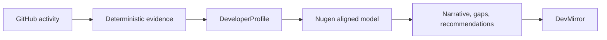
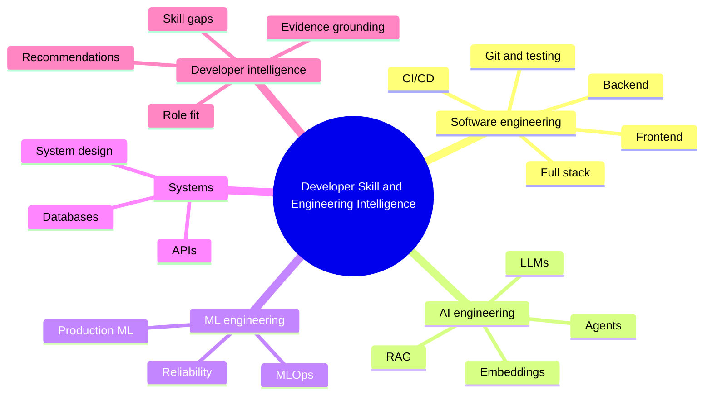
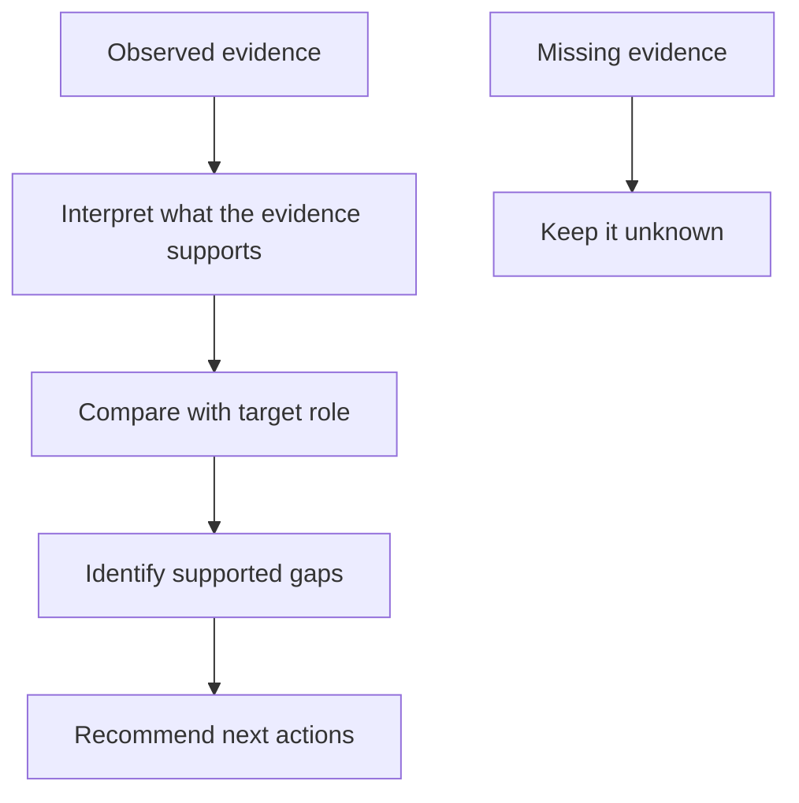
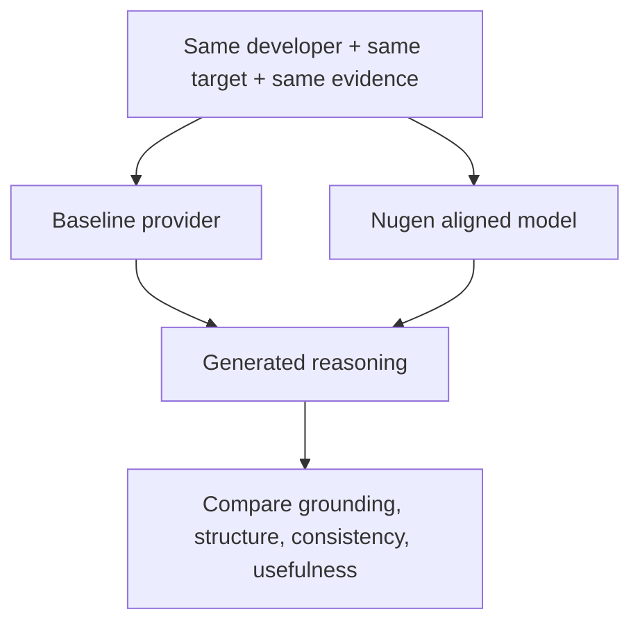
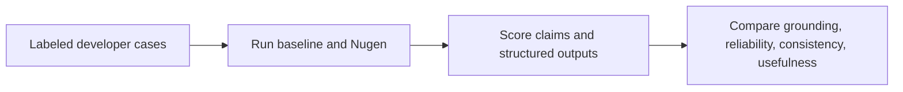

# DevMirror x Nugen: Simple Assessment Explanation

## The short version

I did not use Nugen only to connect an API to an app.

I used Nugen as a domain-aligned reasoning layer for **Developer Skill & Engineering Intelligence**.

The application first collects observable GitHub evidence. The aligned model then reasons about that evidence in an engineering context and produces a profile narrative, skill-gap analysis, and recommendations.

The central question is:

> Does a model aligned to developer and engineering knowledge produce useful, grounded reasoning over the same evidence?

I am not claiming that Nugen is automatically better. I ran an initial controlled comparison and identified the evaluation needed to answer that properly.

---

## 1. What problem does DevMirror solve?

A GitHub profile contains signals, but signals are not the same as proven expertise.

For example:

- A repository using Python does not prove expert Python ability.
- A repository mentioning RAG does not prove a production-quality RAG system.
- The absence of a technology in the profile does not prove the developer has never used it.

DevMirror tries to answer a more careful question:

> Given the evidence we can observe, what engineering skills appear supported, what remains unknown, and what could the developer do next for a target role?

---

## 2. Why this domain?

I chose **Developer Skill & Engineering Intelligence** because the product needs engineering-specific reasoning, not a generic summary.

The domain covers: (referrence - roadmap.sh)

- software, backend, frontend, and full-stack engineering;
- Git, GitHub, testing, CI/CD, and deployment;
- APIs, databases, and system design;
- AI engineering, LLMs, RAG, and agents;
- ML engineering, MLOps, and reliability; and
- developer proficiency, role fit, and skill gaps.

This domain matches both the evidence available from GitHub and the decisions the product is trying to support.

---

## 3. How does the system work?

The important boundary is:

- **Deterministic code** decides what GitHub evidence is present.
- **Nugen** interprets that evidence using engineering-domain knowledge.
- **The UI** turns the interpretation into something actionable.

Nugen is not responsible for inventing repository facts or proving that someone has a skill that the evidence does not establish.

---

## 4. What was aligned?

The alignment corpus was organized around the same concepts the model needs for this task:

The purpose was not to claim that I know the model's internal weights or representations. The purpose was to define the domain and understand the kind of reasoning the model is expected to perform.

---

## 5. What should the model infer?

Example:

> Evidence: public TypeScript and React repositories.
>
> Reasonable inference: the profile shows evidence of frontend and web-development work.
>
> Not justified: the developer is an expert frontend engineer.
>
> Not justified: the developer has strong AI-engineering ability.

That distinction is the main grounding rule in the project.

---

## 6. What did the comparison test?

I compared the baseline provider and Nugen using the same developer, target role, and deterministic evidence.

### Stayed the same

- GitHub-derived evidence;
- repository and language facts;
- deterministic profile values;
- target role and comparison task; and
- core evidence-based classifications.

### Changed

- profile narrative;
- comparative explanation;
- gap interpretation;
- recommendations; and
- suggested missions.

So the defensible result is:

> The same evidence produced provider-dependent reasoning.

That demonstrates the integration and gives us something meaningful to evaluate. It does not prove that Nugen is better.

---

## 7. What did I learn?

1. A domain-aligned model is useful only when its domain matches the product's reasoning problem.
2. Evidence generation and model reasoning should be separated so provider differences can be isolated.
3. GitHub evidence must be treated as incomplete evidence, not as a complete measure of ability.
4. A plausible AI narrative is not enough; outputs need grounding and structured validation.
5. The next step is a labeled benchmark, not a stronger marketing claim.

---

## 8. What would I measure next?

For the same inputs, I would compare both providers on:

- evidence-supported claim rate;
- unsupported-claim rate;
- valid structured-output rate;
- consistency across repeated runs;
- accuracy of skill-gap judgments; and
- usefulness of recommendations, scored by reviewers.

This would test whether alignment provides a measurable benefit instead of assuming it does.

---

## What I would say to Sanket

> Absolutely. I understand that the task is not just to integrate the Nugen API. The important part is understanding the domain the model is aligned to and how that alignment affects reasoning.
>
> I chose Developer Skill & Engineering Intelligence because DevMirror reasons about software-engineering evidence, role fit, and skill gaps. I kept the deterministic GitHub evidence separate from the Nugen reasoning layer, then compared the baseline and Nugen outputs using the same evidence. The evidence stayed stable, while the narrative, gap reasoning, and recommendations changed.
>
> I am treating that as an integration and behavioral result, not as proof that Nugen is better. The next evaluation would use labeled cases to measure grounding, unsupported claims, structured validity, consistency, and recommendation usefulness.

---

## Final answer

The assessment is ready as an integration and model-understanding submission.

The remaining gap is not more documentation. It is a formal quality benchmark that can measure whether the aligned model is actually better for this domain.
