# DevMirror × Nugen Intelligence

DevMirror is a Developer Intelligence application that turns public GitHub evidence into a deterministic `DeveloperProfile`, then uses AI to generate an evidence-grounded narrative, compare developers, identify skill gaps, and propose next actions.

This repository documents a **Nugen domain-alignment assessment** in which the Developer Intelligence AI layer was routed to a deployed Nugen domain-aligned model while the deterministic GitHub evidence pipeline remained the source of truth.

> **Live demo:** https://devmirrorpoweredbynugen.netlify.app/

## Nugen Assessment

The objective was to integrate a domain-aligned model into a real product path rather than call a model from an isolated script.

The selected domain was:

**Developer Skill & Engineering Intelligence**

The experiment deliberately separates:

- **Observed evidence:** deterministic GitHub analysis.
- **Reasoning:** Nugen-generated narrative, comparison interpretation, gaps, and recommendations.

The experiment validates integration and provider-dependent behavior. It does **not** claim that Nugen is statistically better than the baseline provider.

## Domain Alignment

The Nugen alignment corpus covers:

- software, backend, frontend, and full-stack engineering;
- APIs, system design, testing, CI/CD, Git/GitHub, and engineering practices;
- AI/LLM engineering, RAG, agents, embeddings, and semantic search;
- machine-learning engineering, MLOps, and production ML;
- developer proficiency, skill-gap analysis, evidence grounding, and reliability.

The corpus is an assessment deliverable and is not required at application runtime.

## Domain-Aligned Model

The deployed model is the domain-aligned **Llama-V3p2-3b-Reasoning** model created for this domain.

The application reads the deployed identifier from `NUGEN_MODEL_ID` rather than hard-coding it.

```text
model_developer-intelligence-llama-v3p2-3b-reasoning-aligned_alignment_01m238qjs8r2rpe
```

Credentials are server-side environment variables and are not committed.

## Architecture

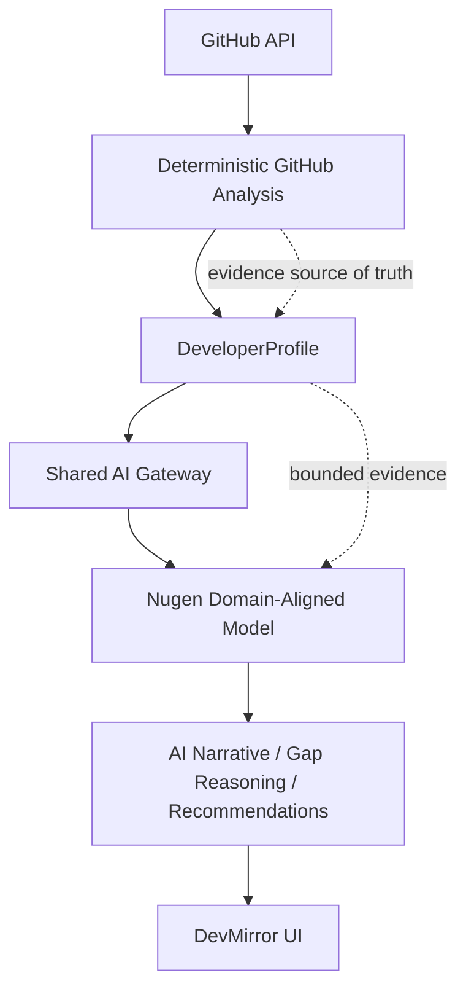

### Integration path

**Profile analysis**

```text
analyzeAndCache
  → enrichProfileWithAI
  → callStructuredWithMetadata({ provider: "nugen" })
  → Nugen completion adapter
```

**Developer comparison**

```text
generateGapAnalysisServer
  → generateGapAnalysis
  → callStructuredWithMetadata({ provider: "nugen" })
  → Nugen completion adapter
```

The Nugen adapter uses the completion API, parses the returned text as JSON, validates the expected structured schema, handles timeouts/errors, and records provider/model provenance.

There is no silent Nugen → Lovable fallback for Developer Intelligence. The existing Lovable branch remains intentionally available for unrelated Role Intelligence and Recruiter functionality.

## Evidence & Grounding

The deterministic analyzer currently uses:

- GitHub repository metadata;
- languages and language statistics;
- repository topics and descriptions;
- root-file signals; and
- project/activity signals.

It does **not** inspect arbitrary source-code implementation details, dependency manifests, README contents, or commit history. A repository's existence alone does not prove a skill.

Nugen is instructed to reason only over the supplied evidence, treat unsupported information as unknown, and avoid unsupported implementation-level claims.

## Validation

The integration was validated at both API and application boundaries:

- Nugen API contract probe succeeded.
- Deployed aligned model returned HTTP 200.
- Completion text, usage metadata, and model metadata were returned.
- The tested response did not expose a live confidence score, so the application keeps confidence unavailable rather than inventing one.
- Structured output is parsed and schema-validated.
- Error handling sanitizes upstream failures and prevents API-key leakage.
- Automated tests cover success/error paths, malformed responses, metadata, null confidence, baseline behavior, and explicit Nugen selection.
- Focused tests passed.
- Production build passed.
- Repository-wide lint still contains unrelated pre-existing formatting issues; full-lint success is not claimed.

## Baseline vs Nugen Experiment

The controlled comparison used the same developer/target/goal across providers:

- Developer: `smilewithkhushi`
- Target: `arjun-builds`
- Goal: **AI Engineer**

Baseline:

```text
https://preview--dev-compass-52.lovable.app/analyze/arjun-builds
```

Nugen-integrated local application:

```text
http://localhost:8081/analyze/arjun-builds
```

| Dimension | Baseline | Nugen |
|---|---|---|
| GitHub evidence | Same deterministic representation | Same deterministic representation |
| Profile facts | Deterministic source of truth | Deterministic source of truth |
| Skills/projects/stack | Deterministic | Deterministic |
| Narrative/trajectory | Baseline-provider generated | Nugen-generated |
| Gap reasoning/missions | Baseline-provider generated where applicable | Nugen-generated |
| Provider provenance | Baseline metadata where available | Nugen provider/model metadata |

### What stayed stable

The core profile and comparison evidence remained essentially stable: repository information, stars/followers, primary languages, skill evidence, projects, technology stack, activity, and deterministic gap information came from the same analysis representation.

### What changed

The provider-dependent layer changed. The generated narrative, trajectory, comparison readout, gap insights, missions, and recommendations differed between the baseline and Nugen runs even though the underlying evidence was held constant.

### Result

The observed result is **provider-dependent variation in reasoning over the same evidence representation**.

That is useful evidence for the integration experiment, but it does not establish which provider is more accurate, reliable, or useful.

## Visual Evidence

The screenshots below document the controlled experiment. In the comparison screenshots, the **left side is the baseline application** and the **right side is the Nugen-integrated application**.

> The screenshot files are stored in `screenshots/` in the intended repository layout.

### Profile and evidence

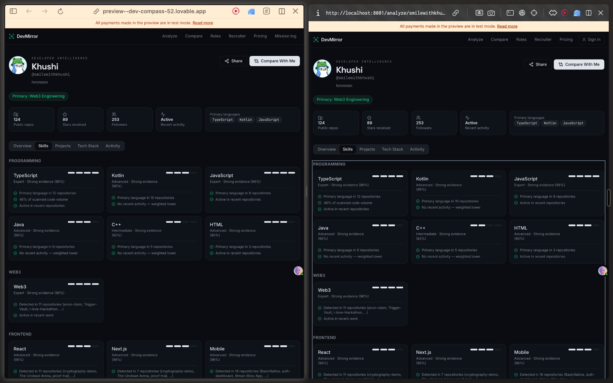

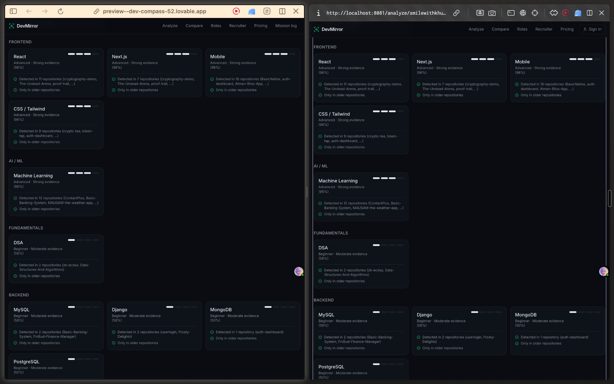

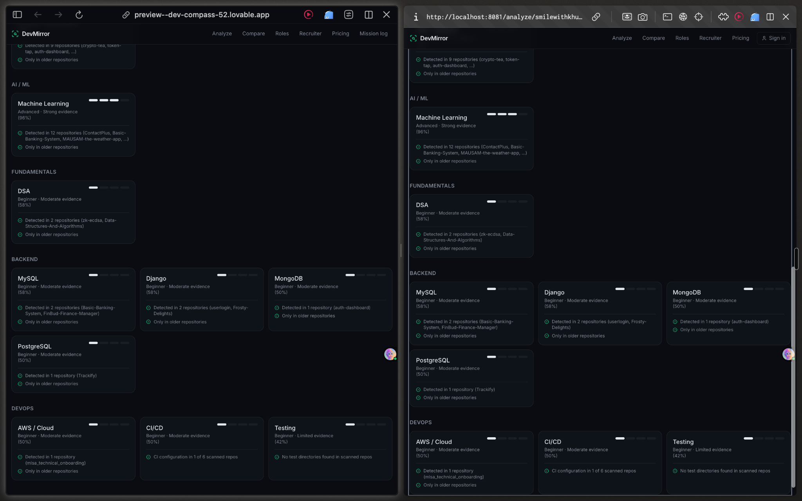

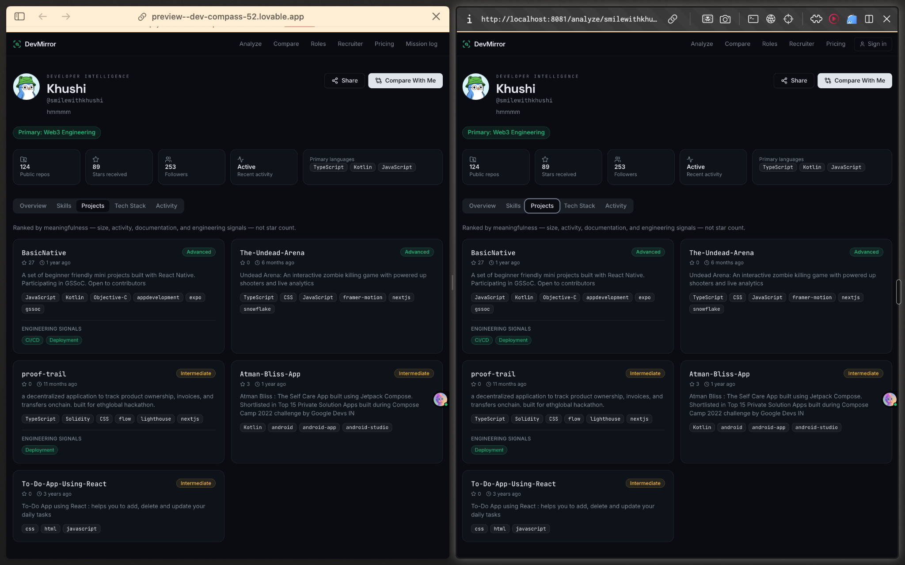

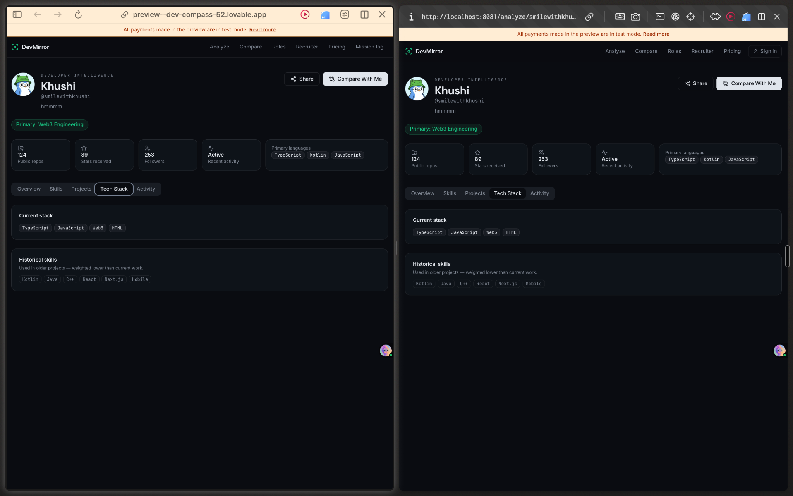

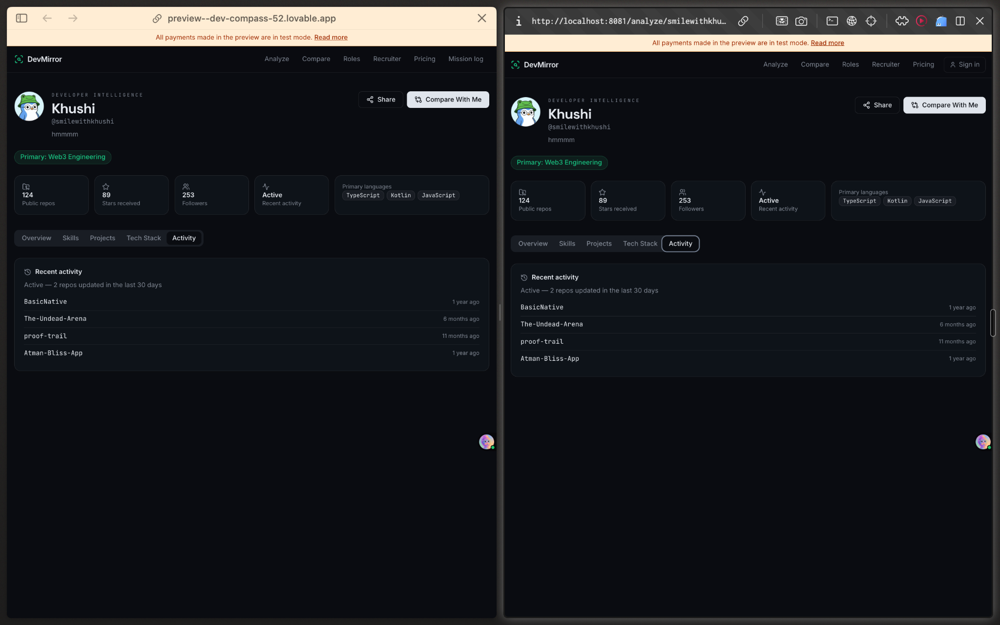

### Controlled comparison

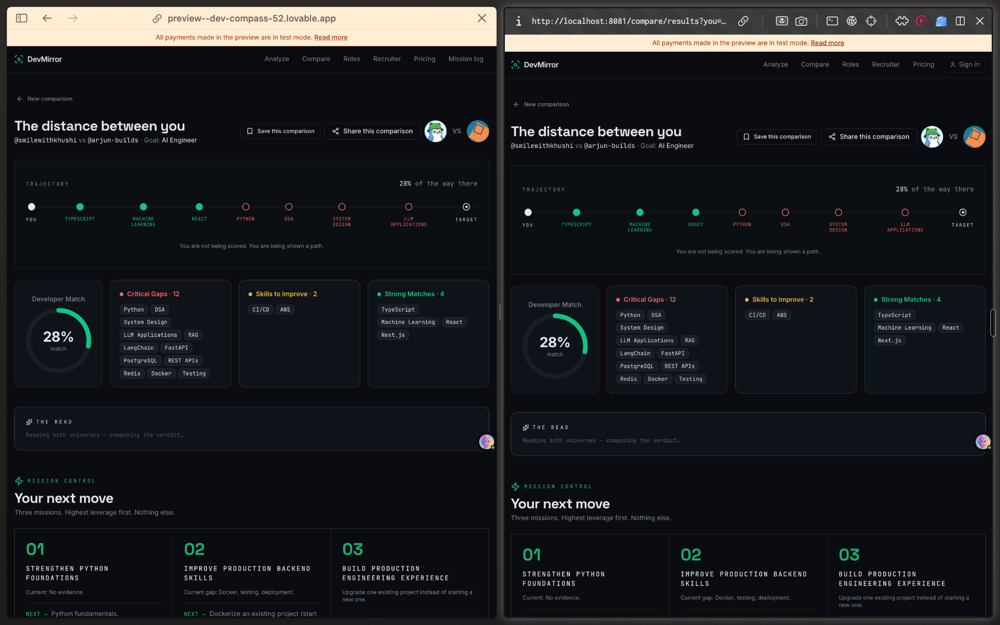

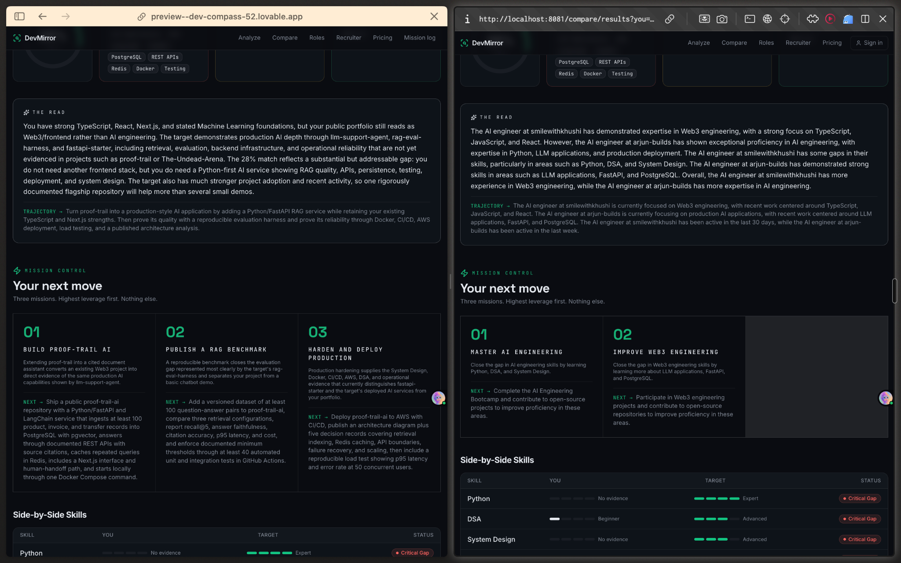

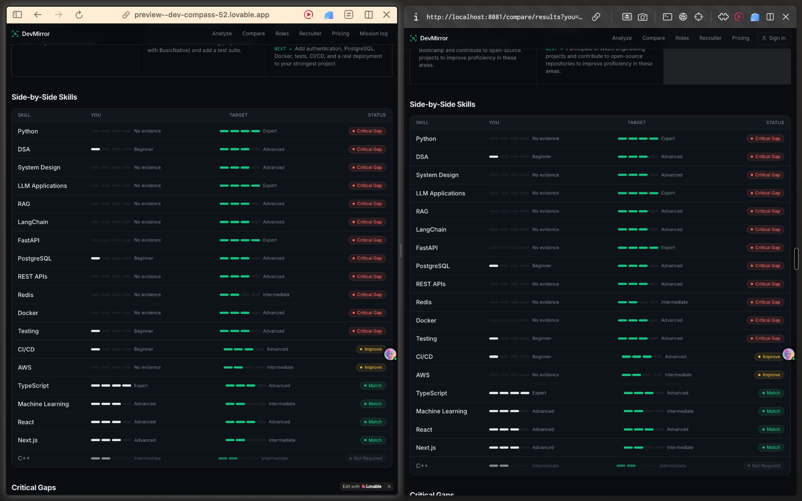

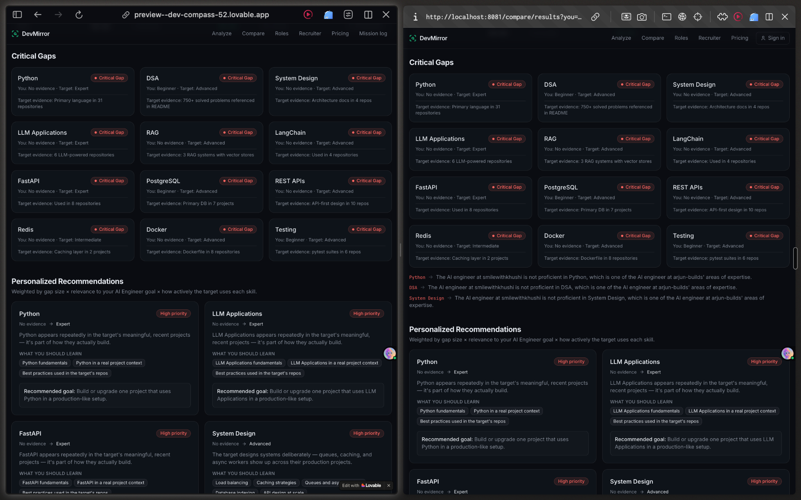

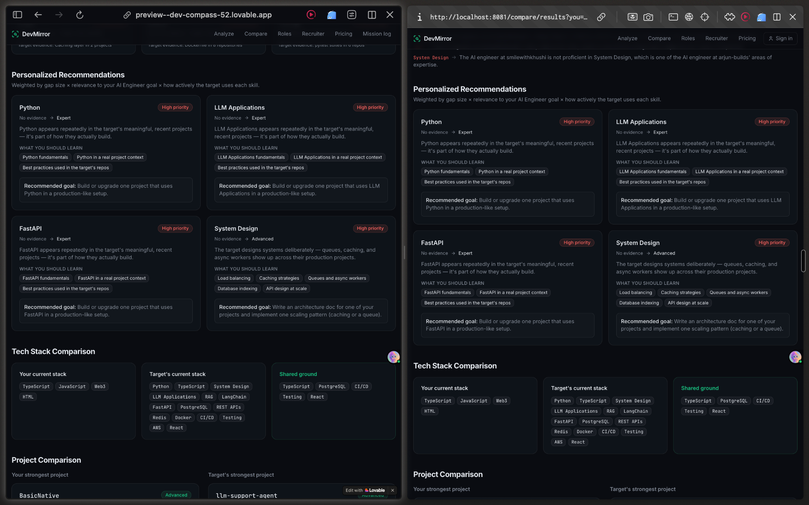

> **How to read these results:** deterministic evidence is held constant. Differences in generated narrative, trajectory, missions, and recommendations are the provider-dependent portion. These screenshots are qualitative evidence of integration and behavioral variation, not a statistical model-quality benchmark.

## Experiment Conclusion

1. **Integration success:** Nugen was deployed as a domain-aligned model and integrated into the real Developer Intelligence execution path.
2. **Evidence stability:** the deterministic GitHub evidence pipeline stayed stable across baseline and Nugen implementations.
3. **Provider-dependent reasoning:** generated narrative and recommendations can vary by provider even with identical evidence.
4. **Grounding boundary:** Nugen reasons over the evidence representation produced by the deterministic analyzer and should not invent unsupported implementation-level skills.
5. **No premature quality claim:** this is an integration/behavioral validation, not a statistically meaningful quality benchmark.
6. **Next experiment:** use a labeled benchmark and measurable metrics to compare providers on identical inputs.

## Limitations

- Small manual qualitative sample.
- No labeled ground truth for profile quality, role-fit, or recommendation quality.
- No statistically significant claim about accuracy, reliability, hallucination rate, or usefulness.
- GitHub evidence cannot prove unobserved engineering work or proficiency.
- Confidence calibration cannot be evaluated until confidence scores are available from the deployed API response.

## Next Evaluation

Build a labeled benchmark containing:

- skill classifications;
- evidence-grounded explanations;
- role-fit judgments;
- skill gaps;
- recommendations; and
- unsupported-claim/hallucination cases.

Run the baseline and Nugen providers against identical evidence inputs and measure:

- factual/evidence-grounded accuracy;
- unsupported-claim rate;
- structured-output validity;
- consistency and reproducibility;
- recommendation usefulness; and
- confidence calibration when scores are available.

This converts the current qualitative A/B exercise into a measurable ML reliability experiment.

## Running Locally

```bash
npm install
cp .env.example .env
npm run dev
```

Validation:

```bash
bun test
npm run build
npm run lint
```

Do not commit `.env` files or secrets.

## Security

Nugen, Supabase, GitHub, and Lovable credentials must never appear in source, tests, screenshots, documentation, or committed environment files. Provider errors are sanitized and credentials remain server-side.

## Assessment Deliverables

- DevMirror source implementation with Nugen-routed Developer Intelligence;
- deployed Nugen domain-aligned model;
- Developer Skill & Engineering Intelligence domain corpus;
- controlled baseline-vs-Nugen experiment;
- proposed labeled benchmark for the next evaluation;
- automated validation/tests; and
- experiment screenshots and architecture documentation.
