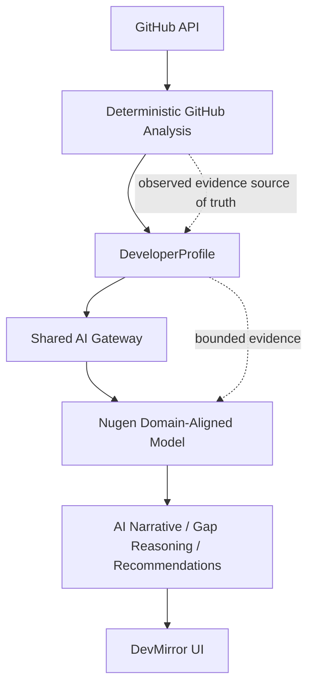

# DevMirror × Nugen Intelligence

DevMirror is a Developer Intelligence application that turns public GitHub evidence into a deterministic `DeveloperProfile`, then uses AI to write an evidence-grounded narrative, compare two profiles, and propose next actions. This repository documents a Nugen domain-alignment assessment in which the Developer Intelligence AI layer is routed to a deployed Nugen model while the GitHub evidence pipeline remains the source of truth.

## Nugen Assessment

The assessment objective was to deploy and integrate a domain-aligned model into a real product path, not merely call a model from an isolated script. The chosen path is DevMirror's Developer Intelligence feature: profile enrichment and developer-comparison gap reasoning.

The experiment holds deterministic GitHub-derived evidence constant and uses Nugen for the bounded reasoning layer built on that evidence. It validates integration behavior and provider-dependent output variation; it is not a benchmark establishing model superiority.

## Problem: Developer Skill & Engineering Intelligence

Developer profiles are often inferred from sparse or self-reported signals. DevMirror instead starts from observable public GitHub signals, builds a structured profile, and uses that representation to answer questions such as:

- What technical work is visible in a developer's public repositories?
- Which skills have direct supporting evidence, and which are uncertain or absent from the available evidence?
- What differentiates two developers for a stated career goal?
- Which concrete next projects or learning actions may address evidence-backed gaps?

This is a meaningful domain-alignment problem because software-engineering reasoning must distinguish observed evidence from unsupported inference. It combines engineering vocabulary, developer proficiency signals, project context, skill-gap analysis, recommendations, and reliability constraints.

## Domain Alignment

The Nugen alignment corpus was created for the **Developer Skill & Engineering Intelligence** domain and used to create the deployed assessment model. Its documented domain coverage includes:

- software, backend, frontend, and full-stack engineering;
- APIs, system design, testing, CI/CD, Git, GitHub, and engineering practices;
- AI/LLM engineering, RAG, agents, embeddings, and semantic search;
- machine-learning engineering, MLOps, and production ML;
- developer proficiency, skill-gap analysis, evidence grounding, and reliability.

The corpus is an assessment deliverable rather than an application runtime dependency. This repository does not reproduce corpus contents, examples, source materials, or credentials.

## Domain-Aligned Model

The deployed model is the domain-aligned **Llama-V3p2-3b-Reasoning** model created for this domain. The application obtains its deployed identifier from `NUGEN_MODEL_ID`; it is not hard-coded in application code.

The non-secret identifier documented by the repository's environment template is:

```text
model_developer-intelligence-llama-v3p2-3b-reasoning-aligned_alignment_01m238qjs8r2rpe
```

Nugen is called through its configured server-side completion endpoint. API credentials remain local, server-side environment variables and are neither committed nor reproduced here.

## Architecture



The deterministic analysis precedes the model. Nugen receives structured evidence and produces the additive narrative/reasoning layer; it does not replace GitHub analysis or establish observed facts.

## Integration

The shared server-side gateway isolates provider transport and structured-output handling. Developer Intelligence makes an explicit Nugen selection at both AI call sites:

```text
Profile analysis:
analyzeAndCache
  → enrichProfileWithAI
  → callStructuredWithMetadata({ provider: "nugen" })
  → Nugen completion adapter

Developer comparison:
generateGapAnalysisServer
  → generateGapAnalysis
  → callStructuredWithMetadata({ provider: "nugen" })
  → Nugen completion adapter
```

The Nugen adapter submits a non-streaming completion request, parses generated completion text, converts it to JSON, and validates it against the existing structured schema before application data is accepted. It preserves timeout handling and sanitized provider errors.

Provider/model provenance is stored on Nugen-enriched profiles as optional `aiProvenance` metadata. A `null` or absent Nugen confidence value remains unavailable; the application does not invent a confidence score.

There is no silent Nugen-to-Lovable fallback for Developer Intelligence. If profile enrichment fails, the existing deterministic-profile fallback remains available. Other errors follow existing safe application behavior rather than switching providers.

The existing Lovable branch remains intentionally in the shared gateway for unrelated Role Intelligence and Recruiter functionality. DevMirror is therefore not globally “Nugen-only”: Developer Intelligence is Nugen-routed, while unrelated existing features may continue to use the baseline provider.

## Evidence & Grounding

The deterministic GitHub analysis is the source of truth for observed evidence. Its available inputs include:

- GitHub repository metadata;
- languages and language statistics;
- repository topics and descriptions;
- root-file signals; and
- project and activity signals.

It does **not** inspect arbitrary source-code implementation details, dependency manifests, README contents, commit history, or prove that a developer possesses a skill merely because a repository exists. Nugen prompts explicitly require use of supplied evidence only, treat unsupported information as unknown, and prohibit unsupported implementation-level claims.

## Validation

The completed validation covered the integration boundary as well as its failure behavior:

- The Nugen API contract probe succeeded against the generic completion endpoint.
- The deployed aligned model was invoked successfully and returned HTTP 200.
- The response supplied completion text, usage metadata, and deployed-model metadata.
- A live confidence score was not available in the tested response, so confidence was retained as unavailable rather than fabricated.
- Generated text is defensively parsed and validated against expected JSON/schema contracts.
- Tests cover successful completion extraction, finish reason, usage, model metadata, null confidence, malformed/missing choices, malformed JSON, sanitized 401/404/5xx errors, API-key non-leakage, default baseline behavior, and explicit Nugen selection.
- Focused tests passed and the production build passed.
- The repository-wide lint command still has unrelated pre-existing formatting issues outside the Nugen implementation; this documentation does not claim full-lint success.

## Baseline vs Nugen Experiment

The manual qualitative comparison used:

- Baseline: `https://preview--dev-compass-52.lovable.app/analyze/arjun-builds`
- Nugen-integrated local application: `http://localhost:8081/analyze/arjun-builds`

It also included a controlled comparison of:

- Developer: `smilewithkhushi`
- Target: `arjun-builds`
- Goal: AI Engineer

| Dimension                                  | Baseline                                                 | Nugen                                                          |
| ------------------------------------------ | -------------------------------------------------------- | -------------------------------------------------------------- |
| Deterministic GitHub evidence              | Same evidence representation under the existing analyzer | Same evidence representation under the existing analyzer       |
| Profile facts, skills, projects, and stack | Deterministic source-of-truth output                     | Deterministic source-of-truth output                           |
| Narrative and trajectory                   | Baseline-provider generated                              | Nugen-generated from supplied evidence                         |
| Gap insights and missions                  | Baseline-provider generated where applicable             | Nugen-generated from supplied comparison evidence              |
| Provider provenance                        | Baseline path metadata where available                   | Nugen provider/model provenance recorded for enriched profiles |

## Experiment Results

### Deterministic evidence

The core `DeveloperProfile` and deterministic comparison stayed essentially stable between the manual baseline and Nugen runs: repository information, stars/followers, primary languages, skill evidence, projects, technology stack, activity, and deterministic gap information came from the same analysis representation.

### AI-generated reasoning

The profile narrative, trajectory, comparison readout, gap insights, and missions are the provider-dependent portion. The earlier controlled comparison showed differences in these generated narratives and recommendations while the underlying deterministic evidence remained fixed.

### Observed difference

The observed result is provider-dependent variation in reasoning over the same evidence representation. It does not by itself establish which provider is more accurate, reliable, or useful.

## Experiment Conclusion

1. **Integration success.** Nugen was successfully deployed as a domain-aligned model and integrated into the real Developer Intelligence execution path.
2. **Evidence stability.** The deterministic GitHub evidence pipeline remained stable across baseline and Nugen implementations, isolating the LLM/provider as the variable affecting generated reasoning.
3. **Provider-dependent reasoning.** Narrative and recommendations can vary by provider even when the underlying evidence is held constant.
4. **Grounding boundary.** The model has access only to the deterministic analyzer's evidence and should not infer unsupported implementation-level skills.
5. **No premature quality claim.** This is an integration and behavioral validation, not a statistically meaningful model-quality evaluation.
6. **Next experiment.** A stronger evaluation should use a labeled benchmark to compare providers on the same evidence inputs and measurable criteria.

## Limitations

- The comparison is a small, manual, qualitative sample.
- There is no labeled ground truth for profile quality, recommendations, or role-fit judgment in this experiment.
- The experiment makes no statistically significant claim about accuracy, reliability, recommendation quality, or hallucination rate.
- GitHub-derived evidence has deliberate coverage limits and cannot prove unobserved engineering work or proficiency.
- Nugen confidence calibration cannot be assessed until confidence scores are available from the deployed API response.

## Next Evaluation

The next ML-engineering evaluation should build a labeled benchmark of developer profiles and expected outcomes, including:

- skill classifications;
- evidence-grounded explanations;
- role-fit judgments;
- skill gaps;
- recommendations; and
- unsupported-claim or hallucination cases.

Run Lovable and Nugen against identical evidence inputs and measure:

- factual and evidence-grounded accuracy;
- unsupported-claim rate;
- structured-output validity;
- consistency and reproducibility;
- recommendation usefulness; and
- confidence calibration, if confidence scores become available.

This would turn the current qualitative A/B exercise into a measurable reliability experiment.

## Running Locally

Use only the repository's existing scripts:

```bash
npm install
cp .env.example .env
npm run dev
```

For validation:

```bash
bun test
npm run build
npm run lint
```

Configure required values in the project-root `.env`. Keep all credentials server-side where required, and do not commit `.env` files.

## Security

Nugen, Supabase, GitHub, and Lovable credentials must never appear in source, tests, documentation, or committed environment files. The Nugen adapter reads its credentials and deployment configuration from server-side environment variables. Provider errors are sanitized so raw upstream diagnostics and credentials are not exposed.

## Assessment Deliverables

- DevMirror source implementation with Nugen-routed Developer Intelligence;
- deployed Nugen domain-aligned model;
- Developer Skill & Engineering Intelligence domain corpus;
- proposed labeled benchmark for the next controlled evaluation;
- automated-test and validation documentation; and
- this architecture and experiment documentation.
